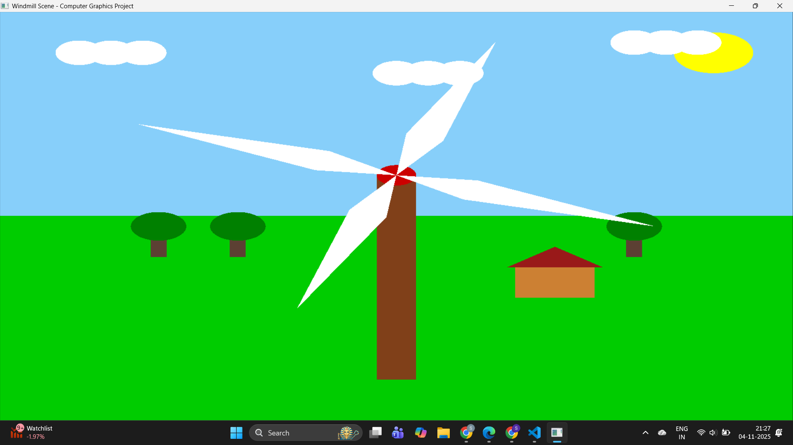

🌬️ Windmill Rotation – Computer Graphics Project (OpenGL)

📘 Overview

This project demonstrates a rotating windmill using OpenGL and FreeGLUT in C++.
The windmill rotates clockwise or anticlockwise using keyboard arrow keys and forms a simple animated 2D scene with sky, ground, sun, and clouds.

🖼️ Features

🌀 Animated rotation of windmill blades

⬅️➡️ Keyboard control for clockwise / anticlockwise rotation

⬆️⬇️ Start / Stop the rotation

☀️ Scenic background with sky, sun, and ground

🏗️ Broader windmill pole for realistic appearance

⚙️ Controls
Key	Action
⬅️ Left Arrow	Rotate Anticlockwise
➡️ Right Arrow	Rotate Clockwise
⬇️ Down Arrow	Stop Rotation
⬆️ Up Arrow	Start / Resume Rotation
🧩 Requirements

C++ Compiler (MinGW or MSYS2)

FreeGLUT library

OpenGL libraries (opengl32, glu32, freeglut)

🏗️ Installation (Windows)

Install MinGW-w64 → Add C:\MinGW\bin to PATH.

Download and extract FreeGLUT (32-bit or 64-bit).

Copy files to:

freeglut/include/GL   →  C:\MinGW\include\GL
freeglut/lib          →  C:\MinGW\lib
freeglut/bin          →  C:\Windows\System32

Save your code as windmill.cpp in your project folder.

▶️ Run the Program
g++ windmill.cpp -o windmill.exe -lfreeglut -lopengl32 -lglu32
./windmill.exe

🧠 Concepts Used

glBegin(GL_POLYGON) for drawing shapes

glTranslatef() and glRotatef() for transformations

glutKeyboardFunc() for user input handling

glutTimerFunc() for animation timing

Basic 2D graphics rendering using OpenGL pipeline

📸 Project Output Screenshot

🌱 Learning & Development
⚡ Challenges Faced

Setting up the OpenGL + FreeGLUT environment on Windows was initially tricky due to missing library paths and configuration issues.

Handling keyboard interactions smoothly while maintaining animation speed consistency required careful logic and transformation control.

Designing a realistic windmill scene with balanced colors, movement, and proportions took several refinements.

🧠 Lessons Learned

Gained hands-on experience with OpenGL functions such as glTranslatef(), glRotatef(), and glutKeyboardFunc().

Understood how event-driven rendering and animation loops work in graphical programming.

Learned the importance of proper library linking and path management while setting up graphics projects in C++.

🚀 Future Features / Roadmap

Add smooth speed control using + and - keys to increase or decrease rotation speed.

Implement mouse-based controls for interactive rotation.

Introduce more 3D elements like a rotating camera, trees, or moving clouds for an enhanced visual experience.

Add sound effects (wind whoosh or clicking sounds) for realism.

Convert the project into a 3D OpenGL scene in future versions.

🧑‍💻 Author

Sakshi H. C. Gowda
